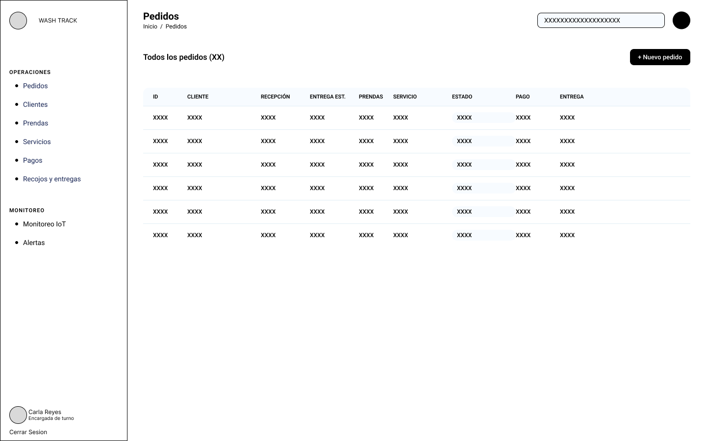

# Capítulo IV: Product Design

## 4.1. Style Guidelines

### 4.1.1. General Style Guidelines
### 4.1.2. Web Style Guidelines

---

## 4.2. Information Architecture
### 4.2.1. Organization Systems
### 4.2.2. Labeling Systems
### 4.2.3. SEO Tags and Meta Tags
### 4.2.4. Searching Systems
### 4.2.5. Navigation Systems

---

## 4.3. Landing Page UI Design
### 4.3.1. Landing Page Wireframe
### 4.3.2. Landing Page Mock-up

---

## 4.4. Web Applications UX/UI Design
### 4.4.1. Web Applications Wireframes

La propuesta de wireframes para WashTrack fue desarrollada teniendo en cuenta los principios 
de usabilidad, diseño inclusivo, claridad visual y jerarquía informativa, con el fin de brindar 
una experiencia coherente, accesible y personalizada tanto para usuarios empresariales como 
personas naturales.
La aplicación se estructura en seis secciones principales, accesibles desde una barra de 
navegación que varía en función del perfil del usuario. Estas secciones son: Inicio, 
Panel de Control, Operaciones, Monitoreo IoT, Clientes y Reportes.

---
**Dashboard**

El wireframe representa el Dashboard  de la aplicación web WashTrack, 
diseñado bajo un esquema de maquetación de dos columnas principales: un menú de navegación 
lateral izquierdo Sidebar y un panel de contenido central Main Area.

**Pedidos**

La vista de Pedidos está orientada a centralizar el flujo de trabajo operativo de la lavandería 
en el rol de Encargada de turno. Presenta una tabla de datos con filtros de búsqueda y acciones 
rápidas como "+ Nuevo pedido", permitiendo monitorear el estado de recepción, entregas estimadas, pagos y detalles de cada orden de manera eficiente.

**Clientes**

Esta pantalla está destinada a la administración del directorio de usuarios por parte de la Encargada
de turno. Dispone de una tabla detallada con filtro de búsqueda y la opción para registrar nuevos usuarios, 
lo que agiliza la localización de información de contacto, identificadores y documentos de identidad.

**Monitoreo IOT**

Esta vista permite a la Encargada de turno supervisar en tiempo real el estado técnico y operativo de toda la
maquinaria conectada. Mediante un panel de tarjetas individuales para cada lavadora, facilita el control de
parámetros en vivo como el ciclo actual, el tiempo restante de lavado y la última sincronización de datos de 
los sensores.

**Alertas**

El wireframe de esta sección está diseñado para centralizar las notificaciones de fallas técnicas en la interfaz 
de la Encargada de turno. Mediante un esquema de tarjetas informativas clasificadas por nivel de criticidad, este 
wireframe permite identificar con rapidez alertas de revisión alta y posibles fallas en la maquinaria, desplegando 
el ciclo en curso, el tiempo restante y la sincronización en vivo para evitar interrupciones operativas.

**Detalle de alerta por lavadora**

El wireframe de esta vista presenta el diagnóstico técnico individualizado de una máquina específica para la Encargada
de turno. Estructura la información mediante indicadores generales de estado, métricas de sensores en tiempo real como 
humedad, corriente, consumo, vibración, velocidad y nivel de agua frente a sus rangos esperados, e incluye un gráfico 
de comportamiento histórico para analizar anomalías a lo largo del tiempo.

### 4.4.2. Web Applications Wireflow Diagrams
### 4.4.3. Web Applications Mock-ups
### 4.4.4. Web Applications User Flow Diagrams

---

## 4.5. Web Applications Prototyping

---

## 4.6. Domain-Driven Software Architecture
### 4.6.1. Design-Level EventStorming
### 4.6.2. Software Architecture Context Diagram
### 4.6.3. Software Architecture Container Diagrams
### 4.6.4. Software Architecture Components Diagrams

---

## 4.7. Software Object-Oriented Design
### 4.7.1. Class Diagrams

---

## 4.8. Database Design
### 4.8.1. Database Diagrams