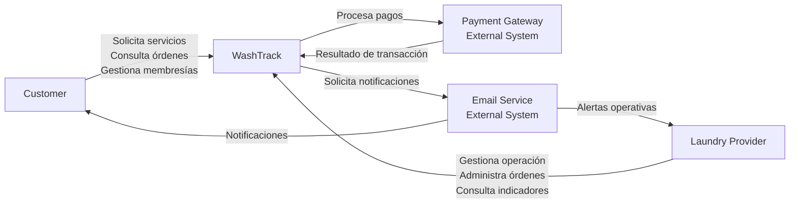

# Capítulo IV: PRODUCT DESIGN

## 4.1. Style Guideline

### 4.1.1. General Style Guidelines

### 4.1.2. Web Style Guidelines

---

## 4.2. Information Architecture

### 4.2.1. Organization Systems

### 4.2.2. Labeling Systems

### 4.2.3. SEO Tags and Meta Tags

### 4.2.4. Searching Systems

### 4.2.4. Navigation Systems

---

## 4.3 Landing Page UI Design

### 4.3.1. Landing Page Wireframe

### 4.3.2. Landing Page Mock-up

---

## 4.4. Web Applications UX/UI Design

### 4.4.1. Web Applications Wireframes

### 4.4.2.1 Web Applications Wireflow Diagrams

### 4.4.2.2 Web Applications Mock-ups

### 4.4.3. Web Applications User Flow Diagrams

---

## 4.5. Web Applications Prototyping

---
### 4.6. Domain-Driven Software Architecture
La arquitectura de WashTrack se organiza utilizando conceptos de **Domain-Driven Design (DDD)** para separar las principales responsabilidades del dominio. Los Bounded Contexts permiten delimitar las reglas y responsabilidades de cada área funcional.

| Bounded Context | Responsabilidad |
|---|---|
| Identity & Access | Gestionar identidad, autenticación y autorización. |
| Order Management | Gestionar solicitudes y órdenes de servicio. |
| Laundry Operations | Gestionar el procesamiento interno de las órdenes. |
| Subscription & Payment | Gestionar membresías, créditos, beneficios y pagos. |
| Tracking & Notifications | Gestionar seguimiento y notificaciones. |
| Customer & Business Management | Gestionar clientes, lavanderías e información operativa. |

### 4.6.1. Design-Level EventStorming

El Design-Level EventStorming identifica los principales **Commands, Aggregates, Domain Events y Policies** necesarios para representar el comportamiento del dominio.

### Commands principales

| Command | Aggregate | Domain Event |
|---|---|---|
| Create Order | Order | OrderCreated |
| Register Special Care | Order | SpecialCareRegistered |
| Select Delivery Method | Order | DeliveryMethodSelected |
| Validate Subscription | Subscription | SubscriptionValidated |
| Apply Benefit | Subscription | BenefitApplied |
| Process Payment | Payment | PaymentProcessed |
| Receive Order | LaundryOrder | OrderReceived |
| Classify Order | LaundryOrder | OrderClassified |
| Assign Washing Cycle | LaundryOrder | WashingCycleAssigned |
| Assign Resource | LaundryOrder | ResourceAssigned |
| Advance Stage | LaundryOrder | ProcessingStageAdvanced |
| Prioritize VIP Order | LaundryOrder | VIPPriorityAssigned |
| Register Status Update | Tracking | OrderStatusUpdated |
| Send Notification | Notification | NotificationSent |
| Detect Delivery Risk | LaundryOrder | VIPDeliveryRiskDetected |

### Aggregates

- **Order:** mantiene la información de una solicitud.
- **Subscription:** controla membresía, vigencia y créditos.
- **Payment:** representa una transacción.
- **LaundryOrder:** representa el procesamiento operativo de una orden.
- **Tracking:** mantiene el historial de estados.
- **Notification:** representa una comunicación generada por el sistema.

### EventStorming

```mermaid
flowchart LR
    C1["Command: Create Order"] --> E1["Event: OrderCreated"]
    E1 --> C2["Command: Validate Subscription"]
    C2 --> E2["Event: SubscriptionValidated"]
    E2 --> C3["Command: Apply Benefit"]
    C3 --> E3["Event: BenefitApplied"]
    E3 --> C4["Command: Process Payment"]
    C4 --> E4["Event: PaymentProcessed"]

    E4 --> C5["Command: Receive Order"]
    C5 --> E5["Event: OrderReceived"]
    E5 --> C6["Command: Classify Order"]
    C6 --> E6["Event: OrderClassified"]
    E6 --> C7["Command: Assign Washing Cycle"]
    C7 --> E7["Event: WashingCycleAssigned"]
    E7 --> C8["Command: Assign Resource"]
    C8 --> E8["Event: ResourceAssigned"]
    E8 --> C9["Command: Advance Stage"]
    C9 --> E9["Event: ProcessingStageAdvanced"]

    E9 --> C10["Command: Register Status Update"]
    C10 --> E10["Event: OrderStatusUpdated"]
    E10 --> C11["Command: Send Notification"]
    C11 --> E11["Event: NotificationSent"]

    E2 --> C12["Command: Prioritize VIP Order"]
    C12 --> E12["Event: VIPPriorityAssigned"]
    E9 --> C13["Policy: Detect VIP Delivery Risk"]
    C13 --> E13["Event: VIPDeliveryRiskDetected"]
```

---

### 4.6.2. Software Architecture Context Diagram
El Context Diagram representa a WashTrack como el sistema central y muestra sus principales actores y sistemas externos.

### Actores

- **Customer:** solicita servicios, gestiona membresías, realiza pagos y consulta el seguimiento.
- **Laundry Provider:** administra órdenes, recursos, clientes y operación.

### Sistemas externos

- **Payment Gateway:** procesa pagos.
- **Email Service:** envía notificaciones.

---

### 4.6.3. Software Architecture Container Diagrams

### 4.6.4. Software Architecture Components Diagrams

---

## 4.7. Software Object-Oriented Design

### 4.7.1. Class Diagrams

---

### 4.8. Database Design

### 4.8.1. Database Diagrams
