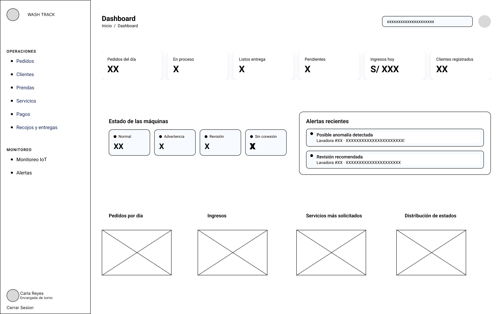

# Capítulo IV: Product Design

## 4.1. Style Guidelines

### 4.1.1. General Style Guidelines
### 4.1.2. Web Style Guidelines

---

## 4.2. Information Architecture
### 4.2.1. Organization Systems
### 4.2.2. Labeling Systems
### 4.2.3. SEO Tags and Meta Tags
### 4.2.4. Searching Systems
### 4.2.5. Navigation Systems

---

## 4.3. Landing Page UI Design
### 4.3.1. Landing Page Wireframe
### 4.3.2. Landing Page Mock-up

---

## 4.4. Web Applications UX/UI Design
### 4.4.1. Web Applications Wireframes

La propuesta de wireframes para WashTrack fue desarrollada teniendo en cuenta los principios 
de usabilidad, diseño inclusivo, claridad visual y jerarquía informativa, con el fin de brindar 
una experiencia coherente, accesible y personalizada tanto para usuarios empresariales como 
personas naturales.
La aplicación se estructura en seis secciones principales, accesibles desde una barra de 
navegación que varía en función del perfil del usuario. Estas secciones son: Inicio, 
Panel de Control, Operaciones, Monitoreo IoT, Clientes y Reportes.

---

El wireframe representa el Dashboard  de la aplicación web WashTrack, 
diseñado bajo un esquema de maquetación de dos columnas principales: un menú de navegación 
lateral izquierdo Sidebar y un panel de contenido central Main Area.

### 4.4.2. Web Applications Wireflow Diagrams
### 4.4.3. Web Applications Mock-ups
### 4.4.4. Web Applications User Flow Diagrams

---

## 4.5. Web Applications Prototyping

---

## 4.6. Domain-Driven Software Architecture
### 4.6.1. Design-Level EventStorming
### 4.6.2. Software Architecture Context Diagram
### 4.6.3. Software Architecture Container Diagrams
### 4.6.4. Software Architecture Components Diagrams

---

## 4.7. Software Object-Oriented Design
### 4.7.1. Class Diagrams

---

## 4.8. Database Design
### 4.8.1. Database Diagrams